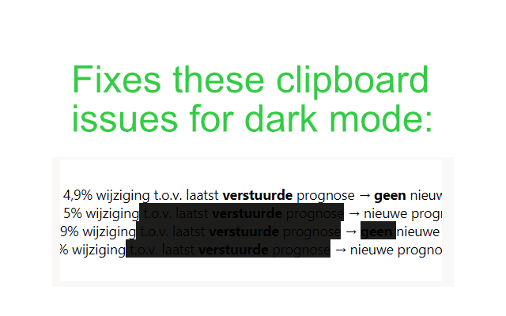

# Azure DevOps Theme Sanitizer

If you use a dark theme in Azure DevOps, you potentially render fields illegible for your fellow light theme coworkers after copying over text from other fields.
This plugin sanitizes theme related code when copying text on Azure DevOps, which should fix most of the legibility problems.

Plugin is in very early development, so stay tuned for updates!

Published at [Google Web store](https://chromewebstore.google.com/detail/azure-devops-clipboard-sa/eoghblbpfpainiedalioipimndfdkipe?hl=en-US&utm_source=ext_sidebar).

